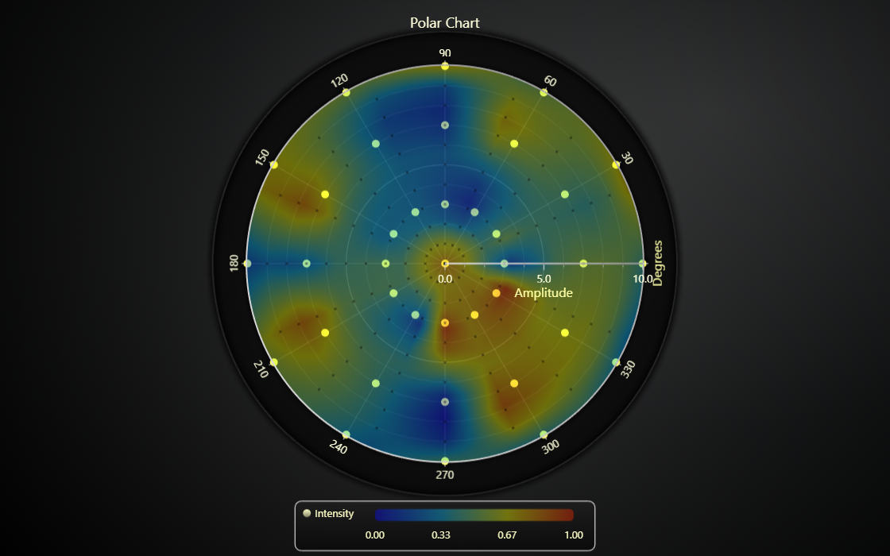

# JavaScript Real-Time Polar Sensor Chart

This demo application belongs to the set of examples for LightningChart JS, data visualization library for JavaScript.

LightningChart JS is entirely GPU accelerated and performance optimized charting library for presenting massive amounts of data. It offers an easy way of creating sophisticated and interactive charts and adding them to your website or web application.

The demo can be used as an example or a seed project. Local execution requires the following steps:

-   Make sure that relevant version of [Node.js](https://nodejs.org/en/download/) is installed
-   Open the project folder in a terminal:

          npm install              # fetches dependencies
          npm start                # builds an application and starts the development server

-   The application is available at _http://localhost:8080_ in your browser, webpack-dev-server provides hot reload functionality.

## Description

Showcase of using Polar Heatmap to visualize a scatter data set in polar coordinates.

To explain that a bit further, the example establishes a number of _sensors_ that are positioned in polar coordinates (angle + amplitude). Each sensor has a numeric measurement, which could be temperature, voltage, etc. These measurements are then _extrapolated_ to linearly ease in the gaps between the sensors. The final extrapolated data set is then visualized with a heatmap.

The example simulates the sensor measurements changing in real-time (60 times per second), immediately recalculates the extrapolated heatmap data and displays it with low latency.

The extrapolation algorithm can be found in the example source code.
Essentially, it calculates a measurement value for each heatmap cell by considering the value and distance to each sensor.

This is a simple but robust algorithm that works for a variety of use cases.

## API Links

* [Polar chart]
* [Polar heatmap series]
* [Polar radial axis]
* [Polar amplitude axis]

## Support

If you notice an error in the example code, please open an issue on [GitHub][0] repository of the entire example.

Official [API documentation][1] can be found on [LightningChart][2] website.

If the docs and other materials do not solve your problem as well as implementation help is needed, ask on [StackOverflow][3] (tagged lightningchart).

If you think you found a bug in the LightningChart JavaScript library, please contact support@lightningchart.com.

Direct developer email support can be purchased through a [Support Plan][4] or by contacting sales@lightningchart.com.

[0]: https://github.com/Arction/
[1]: https://lightningchart.com/lightningchart-js-api-documentation/
[2]: https://lightningchart.com
[3]: https://stackoverflow.com/questions/tagged/lightningchart
[4]: https://lightningchart.com/support-services/

© LightningChart Ltd 2009-2022. All rights reserved.

[Polar chart]: https://lightningchart.com/js-charts/api-documentation/v5.0.1/classes/PolarChart.html
[Polar heatmap series]: https://lightningchart.com/js-charts/api-documentation/v5.0.1/
[Polar radial axis]: https://lightningchart.com/js-charts/api-documentation/v5.0.1/interfaces/PolarAxisRadial.html
[Polar amplitude axis]: https://lightningchart.com/js-charts/api-documentation/v5.0.1/classes/PolarAxisAmplitude.html

